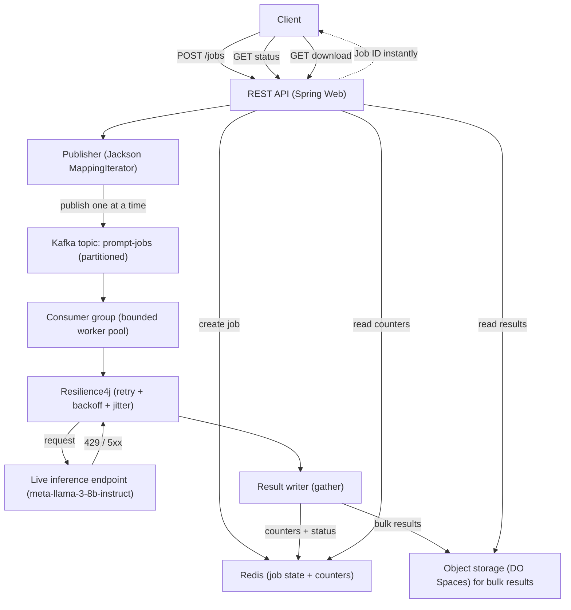
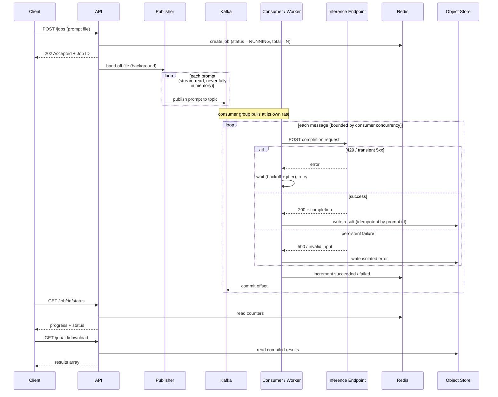

# Architecture — Async Batch Evaluation Engine

## 1. Purpose

This service accepts a file containing an array of prompts, runs every prompt
through a live LLM inference endpoint, survives the upstream's rate limits and
transient failures, and assembles the results into a retrievable report.

The defining constraint is that the upstream inference endpoint is **slow,
rate-limited, and occasionally fails**. Every architectural decision below
follows from absorbing those three properties without losing work, blocking the
caller, or running out of memory.

| Property of the endpoint | Consequence | Mechanism in this design |
|---|---|---|
| Slow (hundreds of ms to seconds per call) | Caller cannot wait synchronously | Async job model — return a Job ID immediately, process off a Kafka topic |
| Rate-limited (HTTP 429 under load) | Cannot fire all prompts at once | Bounded consumer group + Resilience4j retry with backoff and jitter |
| Fallible (HTTP 500, malformed input) | One bad row must not sink the batch | Per-message failure isolation, recorded as an error |
| Dataset can reach 500k items | Cannot hold everything in RAM | Stream-publish to Kafka; results to object storage |

This build is implemented on **Kafka + Redis**: Kafka is the work-distribution
backbone (the scatter), and Redis holds job state. This choice is revisited with
its trade-offs in §5.2.

---

## 2. High-Level Flow



The only component we do **not** control is the inference endpoint, which is why
the retry/backoff logic sits exactly at that boundary. Note the two distinct
backpressure points: Kafka throttles the *queue* (consumers pull at their own
rate), and Resilience4j throttles the *endpoint* (the 429 retry loop). See §5.3.

---

## 3. Request Lifecycle



---

## 4. Components and Responsibilities

- **REST API layer** — three endpoints: `POST /jobs` (submit, returns Job ID),
  `GET /job/{id}/status` (progress), `GET /job/{id}/download` (compiled results).
- **Publisher** — reads the prompt file with a *streaming* iterator and publishes
  one prompt at a time to the Kafka topic. Runs in the background so the submit
  response is instant.
- **Kafka topic `prompt-jobs`** — partitioned durable queue. Partition count sets
  the maximum useful consumer parallelism.
- **Consumer group (worker pool)** — the "scatter." Consumer concurrency is the
  bounded worker pool; the group pulls messages at its own pace.
- **Resilience4j guard** — wraps every endpoint call with retry, exponential
  backoff, and jitter, scoped to retryable conditions.
- **Result writer** — the "gather." Writes each outcome (success or isolated
  error) to durable storage and updates Redis counters.
- **Redis** — job state: status, total, succeeded/failed counters, served by the
  status endpoint.
- **Object storage (DigitalOcean Spaces)** — bulk result payloads, served by the
  download endpoint. (Small jobs may keep results in Redis; see §5.6.)

---

## 5. Design Decisions and Rationale

### 5.1 Asynchronous job model (return a Job ID, publish in the background)

**Decision.** `POST /jobs` validates the request, registers the job in Redis,
hands the file to a background publisher, and returns `202 Accepted` with a Job
ID. Progress is polled via the status endpoint.

**Why.** A synchronous design would hold one HTTP connection open for the entire
batch — minutes for 1,000 prompts, far longer at 500,000. Publishing the messages
also takes time at scale, so even that runs in the background; the API returns
the moment the job is registered.

### 5.2 Kafka as the work-distribution backbone

**Decision.** Prompts are published to a partitioned Kafka topic and processed by
a consumer group. Consumer concurrency is the bounded worker pool.

**Why.** Kafka decouples submission from processing, is durable (work survives a
process crash), and scales horizontally — adding consumer instances to the group
rebalances partitions automatically. It also makes the assignment's extension
goals (crash recovery, progressive state) first-class rather than future work.

**Trade-off acknowledged.** Kafka adds operational weight: a broker to run and a
service container in CI (via Testcontainers). For a single-process app reading a
local file, an in-process executor would have fewer moving parts. Kafka is chosen
here because durability, crash recovery, and horizontal scale are explicit goals,
and because it keeps the queue and the application logic cleanly separated.

**What stays hand-written.** Kafka does *not* implement the LLM's 429 handling —
that endpoint-level backpressure remains application logic (§5.3). So the
consumer group provides the *bound*, while the retry policy provides the
*resilience*; both are deliberate, not delegated wholesale to the broker.

### 5.3 Two layers of backpressure

**Decision.** Backpressure is handled at two distinct points.

1. **Queue-level (Kafka).** Consumers pull messages at their own rate; they never
   over-fetch. If the endpoint is overwhelmed, a consumer can `pause()` its
   partitions and `resume()` once the pressure clears.
2. **Endpoint-level (Resilience4j).** Each call is wrapped in a `Retry` with
   exponential backoff and randomized jitter, scoped to 429 and transient 5xx.

**Why backoff and jitter.** A 429 means "slow down"; immediate retries make it
worse, so backoff lengthens the wait after each failure. Without jitter, every
worker that hit a 429 at the same instant retries at the same instant — a
synchronized stampede that re-triggers the limit. Jitter spreads retries across a
window so load smooths out. After a capped number of attempts a message is
recorded as a permanent failure rather than retried forever.

### 5.4 Streaming publish (minimal in-memory footprint)

**Decision.** The publisher reads the input array with Jackson's `MappingIterator`
and publishes each prompt as it is read — never materializing the whole array.

```java
try (MappingIterator<Prompt> it =
         objectMapper.readerFor(Prompt.class).readValues(inputStream)) {
    while (it.hasNext()) {
        kafkaTemplate.send("prompt-jobs", jobId, it.next());
    }
}
```

**Why.** This is the answer to the out-of-memory requirement. Naively loading all
prompts into a `List` has memory that grows linearly with the dataset and crashes
on the way to 500,000 items. With stream-publish, Kafka becomes the buffer, not
the application heap — resident memory stays bounded by consumer concurrency, not
dataset size, so the same code path serves 1,000 and 500,000 prompts.

### 5.5 Partial failure isolation

**Decision.** Each message is processed independently. A failure (persistent 5xx,
invalid input, exhausted retries) is caught, recorded against that prompt, and the
consumer moves on, committing the offset so the message is not retried forever.

**Why.** The unit of failure is a single prompt, not the job. Throwing away 999
good results because one row was malformed defeats the purpose of a batch engine.
The status endpoint reports succeeded/failed counts; the download includes both
successes and the isolated error records. Poison messages can be routed to a
dead-letter topic for later inspection.

### 5.6 State in Redis, bulk results in object storage

**Decision.** Redis holds job status and atomic counters (`INCR
job:{id}:succeeded` / `:failed`). Large result payloads are written to object
storage (DigitalOcean Spaces), keyed by job and prompt id.

**Why.** Redis is in-memory, so storing 500,000 full LLM responses there would
balloon its footprint. Keeping Redis for small, hot state (fast atomic counters
for the status endpoint) and offloading the bulk results to object storage keeps
both within their strengths. For small jobs (~1,000 items) results may stay in
Redis; the switch to object storage is the documented scale threshold (§7).

### 5.7 Crash recovery and at-least-once delivery

**Decision.** Recovery relies on Kafka consumer offsets plus Redis state.
Unprocessed messages are redelivered after a crash; progress is read back from
Redis. Because delivery is at-least-once, a message may be reprocessed, so result
writes are **idempotent** — keyed by prompt id, so a duplicate overwrites rather
than double-counts.

**Why.** This turns crash recovery from "future work" into a property of the
design. The idempotency key is what makes redelivery safe; without it,
at-least-once delivery would inflate the success counts.

---

## 6. Technology Choices

| Concern | Choice | Reason |
|---|---|---|
| Framework | Spring Boot (Spring Web) | Idiomatic REST + dependency injection |
| Work queue / scatter | Kafka (Spring Kafka) | Durable, partitioned distribution; consumer group is the bounded pool |
| Job state | Redis (Spring Data Redis) | Fast atomic counters for status; shared across instances |
| Bulk results | Object storage — DigitalOcean Spaces (AWS SDK) | Spaces is S3-compatible; avoids Redis memory blow-up |
| HTTP client | `RestClient` | Modern synchronous client for the endpoint call |
| Resilience | Resilience4j | Retry with exponential backoff + jitter; optional rate limiter / bulkhead |
| Streaming read | Jackson `MappingIterator` | Publish prompts without loading the whole array |
| Testing | JUnit 5, Mockito, Spring Boot Test, **Testcontainers** (Kafka + Redis), **WireMock** (fake endpoint), Awaitility | Testcontainers spins up real Kafka/Redis; WireMock simulates 429/500/latency to prove backpressure; Awaitility asserts async completion |
| Build + CI | Maven or Gradle + GitHub Actions | Runs the full suite on push |

---

## 7. Scaling Thresholds

The architecture is staged so that scale-ups are additive rather than rewrites.

| Scale | What holds | What changes |
|---|---|---|
| ~1,000 prompts, single instance | Everything above; results may stay in Redis | Nothing |
| ~500,000 prompts, single instance | Stream-publish keeps memory flat; consumer concurrency caps in-flight calls | Move bulk results from Redis to object storage; raise topic partition count and consumer concurrency |
| Horizontal scale (multiple instances) | The processing model is unchanged | Add consumer instances to the same group — Kafka rebalances partitions automatically. This is a deployment change, not a code change |
| Endpoint is the bottleneck | Retry policy absorbs 429s | Add a Resilience4j `RateLimiter` to throttle proactively, and `pause()`/`resume()` consumers to shed load at the queue |

The single most important property at every tier is that **resident memory is a
function of consumer concurrency, not dataset size** — that is what lets the same
code path serve 1,000 and 500,000 items without a full-table OOM. Because Kafka
already decouples producers from consumers, the jump to multiple instances is the
cheapest tier transition in the table.

---

## 8. Failure Modes

| Failure | Handling |
|---|---|
| Upstream 429 (rate limit) | Resilience4j retry with exponential backoff + jitter, capped attempts; consumer may pause/resume |
| Transient upstream 5xx | Same retry policy as 429 |
| Persistent upstream 5xx | Recorded as an isolated error after retries are exhausted; offset committed; batch continues |
| Malformed prompt | Failed fast as an isolated error; not retried; optionally dead-lettered |
| Consumer / process crash mid-job | Kafka redelivers uncommitted messages; Redis holds progress; job resumes |
| Duplicate delivery (at-least-once) | Result writes are idempotent (keyed by prompt id), so duplicates overwrite rather than double-count |
| Poison message (repeatedly fails) | Routed to a dead-letter topic after capped retries for later inspection |
